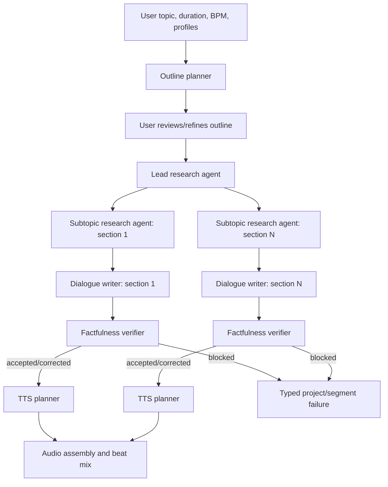

# Agent Orchestration

> Implementation status: purpose routing, strict verification, safe profiles, Eleven request planning, and bounded parallel scene execution exist. Durable lease-driven restart recovery, pre-provider accounting, hard-budget enforcement, globally unique persisted plan identities, and the formal v3-versus-stitched activation gate remain production-hardening work.

The generation system uses server-owned, purpose-specific LLM routing rather than asking one model to perform every task. A user chooses an opaque profile such as `economy` or `balanced`; the backend resolves it into immutable internal routes.

## Step-by-step

1. **Profile resolution** — The API resolves opaque LLM and TTS profile IDs. Provider names, model IDs, voice bindings, pricing, and keys remain server-side. Both snapshots are hashed and persisted before accepted project work.
2. **Outline planning (`outline`)** — A low-cost, creative route returns structured title and sections. The preview is owner-scoped, expires, and can be consumed only once.
3. **Human refinement** — The iOS client may edit the title and section topics. Changing either generation profile invalidates the preview because it changes the execution contract.
4. **Lead research (`research_brief`)** — Produces episode-wide framing, useful facts, tensions, and follow-up questions. This avoids repeating broad research in every section prompt.
5. **Subtopic research (`subtopic_research`)** — Runs for each section with its local topic and the lead brief. This keeps prompts focused and makes failures attributable to one section.
6. **Dialogue drafting (`dialogue_draft`)** — Generates canonical `Interviewer:` and `SME:` turns using the approved outline, research, neighboring section context, and prior text.
7. **Factfulness verification (`fact_verification`)** — Returns exactly one typed outcome: `accepted`, `corrected`, or `blocked`. Missing or malformed verification fails closed; an unverified draft never reaches TTS.
8. **TTS planning** — The default ElevenLabs v3 strategy groups bounded alternating turns into natural dialogue scenes. The alternate stitched strategy creates ordered single-speaker fragments.
9. **Provider execution** — Scene requests execute with bounded parallelism. Every plan has unique attempt, ledger, temporary-file, and output identities. Ambiguous post-dispatch failures become `unknown_outcome` and are not blindly replayed.
10. **Ordered assembly** — Results may finish out of order, but assembly follows persisted plan order. Audio is decoded, normalized, concatenated at controlled boundaries, and checksummed.
11. **Beat mix** — The procedural beat is generated for actual duration, ducked beneath speech, raised at transitions, normalized, and exported to MP3.
12. **Publication** — Internal clips remain inaccessible. Segment and final artifacts are published only after metadata and readiness transitions are durable.

## Why these choices

- **Purpose-specific models:** research benefits from accuracy and context; drafting benefits from style and output economics; verification benefits from low temperature and stronger reliability.
- **Server-owned profiles:** clients cannot leak credentials, select incompatible models, or become coupled to provider inventory churn.
- **Immutable snapshots:** a deployment/configuration change cannot alter an already accepted episode halfway through generation.
- **Section-scoped agents:** smaller prompts improve cost control, retries, observability, and partial readiness.
- **Typed verifier gate:** silent fallback to an unverified draft would make provenance meaningless.
- **Text-to-Dialogue v3 default:** bounded multi-turn scenes preserve conversational prosody better than sentence-isolated synthesis.
- **Bounded parallel TTS:** reduces latency without unbounded provider pressure. Completion order never changes narrative order.
- **Unknown-outcome state:** ElevenLabs has no general idempotency key; replaying an ambiguous request could duplicate billing and audio.
- **Durable work/attempt records:** background execution can be reconciled after process restart rather than existing only in thread memory.
