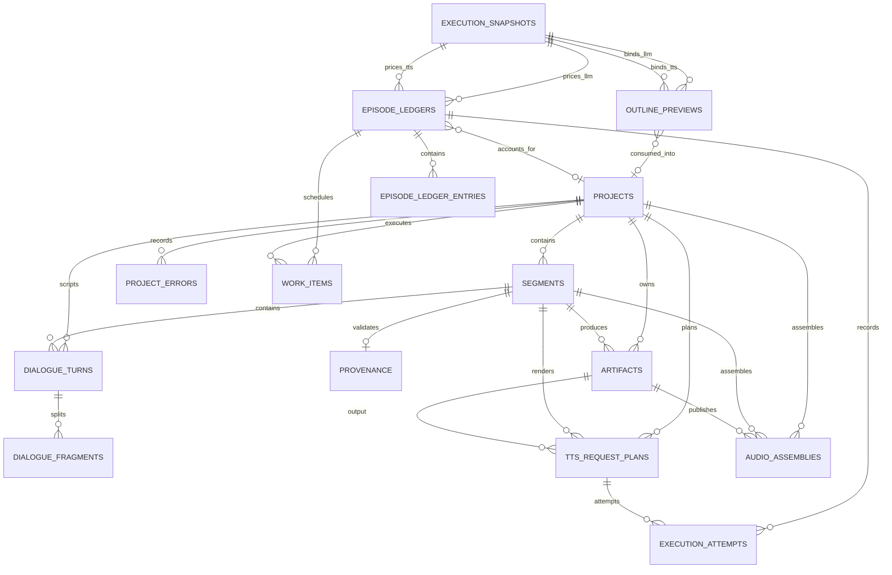

# Database ER Diagram

SQLite is the durable product store. WAL mode permits concurrent reads while application writes use bounded transactions and a busy timeout.

## Table responsibilities

| Table | Responsibility |
|---|---|
| `projects` | Canonical project manifest, lifecycle, revision, and final readiness. |
| `segments` | Ordered script/audio units and per-segment errors. |
| `provenance` | Validation result persisted before TTS. Public model value is redacted. |
| `artifacts` | Durable metadata for internal and public media files. |
| `project_errors` | Project-scoped typed failures and retryability. |
| `execution_snapshots` | Immutable server-only LLM/TTS routing configuration and hash. |
| `outline_previews` | Expiring, owner-scoped outline plus paired profile snapshots; consumed once. |
| `episode_ledgers` | One accounting authority shared by preview, project, LLM, and TTS. |
| `episode_ledger_entries` | Append-only reservations, actuals, releases, rejections, and observations. |
| `work_items` | Durable background work and leases for restart reconciliation. |
| `dialogue_turns` | Ordered interviewer/guest text. |
| `dialogue_fragments` | Sentence-safe subdivisions for stitched per-speaker TTS. |
| `tts_request_plans` | Strategy-specific remote request plans and leases. |
| `execution_attempts` | Physical provider attempts, outcomes, usage, costs, and errors. |
| `audio_assemblies` | Ordered input manifest, processing revision, checksum, and publication state. |
| `schema_migrations` | Applied schema versions. |

## Durability invariants

1. Preview and project execution use immutable snapshots, never mutable current configuration.
2. Provenance is stored before a segment enters TTS.
3. Provider attempt and accounting records are append-only evidence.
4. Artifact metadata is stored before a segment becomes ready.
5. Internal TTS clips are denied by public artifact routes.
6. A final artifact becomes downloadable only after every required segment is ready.
