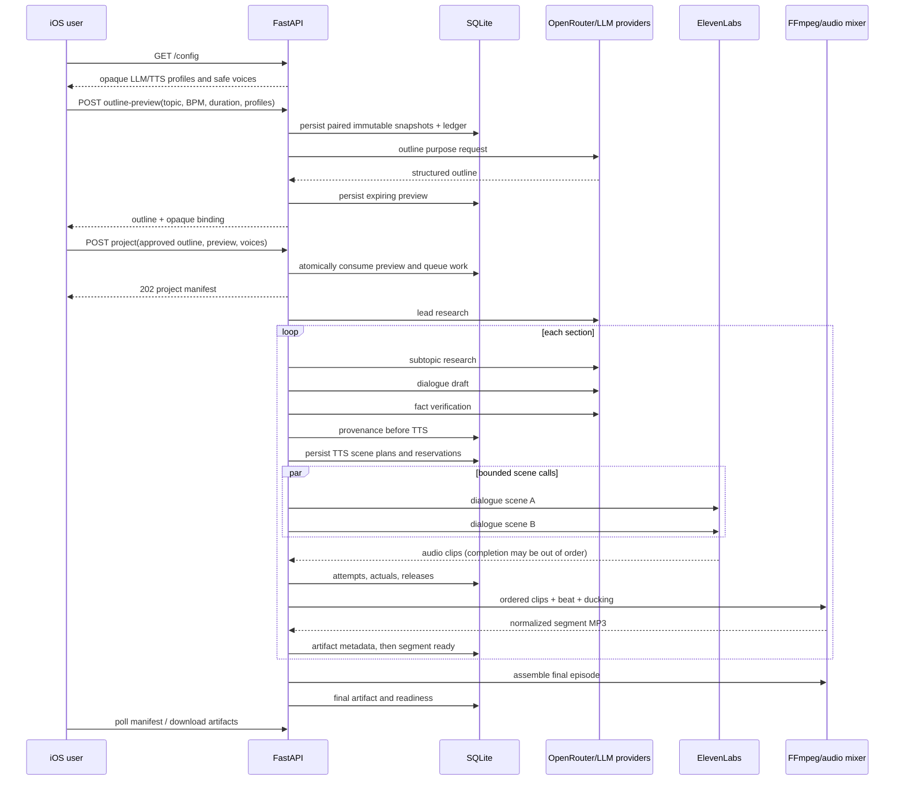

# End-to-End Generation Pipeline

> Status: this document describes the target production pipeline and the portions already represented by current schemas and adapters. The current implementation still uses an in-process daemon-thread worker and does not yet satisfy the full lease/restart, pre-provider ledger reservation, hard-budget, or ambiguous-outcome reconciliation contract. Treat those items as required production hardening, not completed guarantees.

## Inputs

The client supplies topic, target duration, BPM, an opaque generation profile, an opaque TTS profile, optional interviewer/guest style hints, safe speaker voice IDs, and optionally a user-approved outline. Secrets never cross the client boundary.

## Text generation

The profile maps each purpose to a provider/model internally. Output is structured JSON and strictly parsed. The generation order is outline, lead research, per-section research, per-section dialogue, and per-section verification. Section context includes neighboring topics and previous generated text to maintain continuity.

## TTS

The script parser accepts canonical interviewer and SME turns. With `text_to_dialogue_v3`, turns are grouped into scenes bounded by character and turn limits. Multiple scenes are sent to ElevenLabs concurrently using a bounded thread pool (`max_concurrent_requests`, currently 4). Each scene uses a unique plan ID, attempt ID, staging file, and destination path.

Concurrency rules:

- The pool cannot exceed the immutable TTS snapshot limit.
- Database connections are per thread; SQLite WAL, busy timeout, and short transactions protect concurrent writes.
- Attempt and ledger records use unique IDs and upsert/append semantics.
- Results are collected by plan ID and assembled in original plan order, never completion order.
- On failure, queued futures are cancelled where possible. Already dispatched ambiguous failures are recorded as `unknown_outcome`; no public artifact is assembled or marked ready.
- `max_concurrent_requests=1` preserves deterministic sequential execution for constrained deployments.

## Audio processing

Provider MP3 clips are staged, flushed, fsynced, validated as non-empty, and atomically renamed. Ordered clips are decoded to a common PCM format. Controlled outer scene boundaries receive configured gaps/crossfades; opaque internal v3 timing is preserved. Speech is normalized, mixed with a procedurally generated BPM bed using speech-aware ducking, peak-limited, converted to MP3, checksummed, and registered before readiness.

## Failure and recovery

The pipeline preserves ready segments if another segment fails. Durable work items, request plans, attempts, ledgers, and assembly manifests allow reconciliation after restart. Failures before dispatch may retry according to policy. Ambiguous post-dispatch transport or partial-stream outcomes do not retry automatically because the remote request may already have been billed and generated.
